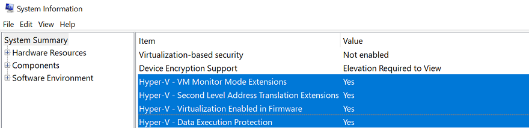
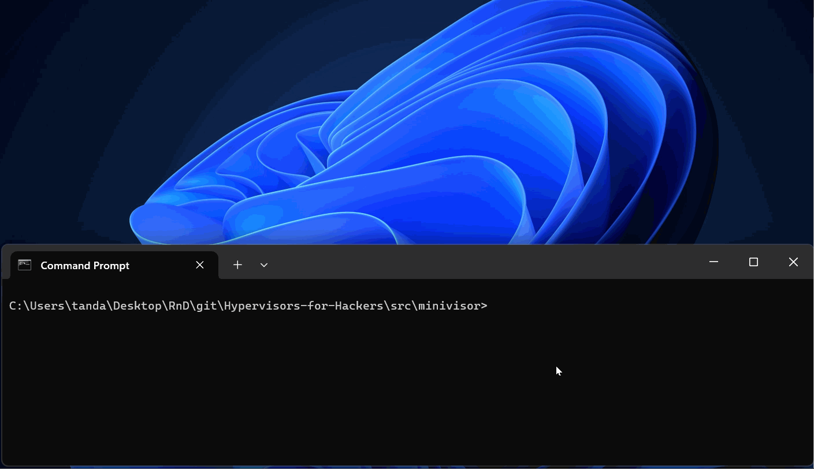

# Setup instructions

This document shows the instructions for setting up the exercise environment. It is highly recommended
to arrange hardware that satisfies the requirements below to go through exercises and learn better.
It is not mandatory however, as we tackle exercises as a group at GCC.

Contact the trainer as you run into issues or have any questions.

- [Setup instructions](#setup-instructions)
  - [System requirements](#system-requirements)
  - [Setup instructions](#setup-instructions-1)
    - [Disabling Hyper-V](#disabling-hyper-v)
    - [Enabling the developer mode](#enabling-the-developer-mode)
    - [Installing software](#installing-software)
    - [Creating a VM and a snapshot](#creating-a-vm-and-a-snapshot)
    - [Testing the setup](#testing-the-setup)

## System requirements

- CPU: Intel processors
- OS: Windows 11
- Storage: 50GB of more free space
- Permissions: You have administrator permissions, and are able to and conformtable with disabling
    security features such as Virtualization-based Security.

> [!NOTE]
> A physical machine must be used. A virtual machine is not compatible.

## Setup instructions

### Disabling Hyper-V

> [!NOTE]
> This is a requirement for enabling nested-virtualization on VMware.

To disable Hyper-V:
1. Turn off
    - Settings > Privacy & security > Windows Security > Device security > Core isolation details >
      Memory integrity
2. On an elevated command prompt, run
    ```
    bcdedit /set hypervisorlaunchtype off
    ```
3. Reboot.

If Hyper-V is fully disabled, `msinfo32.exe` shows compatibility with hypervisors as below.



<details><summary>If Hyper-V is still enabled</summary>

- Control Panel > Programs > Turn Windows features on or off
    - Hyper-V > Hyper-V Platform > Hyper-V Hypervisor
    - Microsoft Defender Application Guard
    - Virtual Machine Platform
    - Windows Hypervisor Platform
- On registry editor, set
    - HKEY_LOCAL_MACHINE\SYSTEM\CurrentControlSet\Control\DeviceGuard
        - EnableVirtualizationBasedSecurity = 0 (DWORD)
    - HKEY_LOCAL_MACHINE\SYSTEM\CurrentControlSet\Control\DeviceGuard\Scenarios\CredentialGuard
        - Enabled = 0 (DWORD)
    - HKEY_LOCAL_MACHINE\SYSTEM\CurrentControlSet\Control\DeviceGuard\Scenarios\HypervisorEnforcedCodeIntegrity
        - Enabled = 0 (DWORD)
    - HKEY_LOCAL_MACHINE\SYSTEM\CurrentControlSet\Control\DeviceGuard\Scenarios\SystemGuard
        - Enabled = 0 (DWORD)
- Then, reboot

If still does not work, try disabling secure boot.

</details>

### Enabling the developer mode

> [!NOTE]
> This is a requirement for using `cargo make`.

1. Open "Settings" on Windows
2. Click on System > Advanced
3. Scroll down and enable Developer Mode

### Installing software

> [!NOTE]
> Leave default options if installers ask but this instruction does not specify. Non-default options
> may also work but it is case-by-case.

1. Install [Rust](https://rust-lang.org/tools/install/).
2. Install [cargo make](https://github.com/sagiegurari/cargo-make) by running this command:
    ```
    cargo install --locked cargo-make --no-default-features --features tls-native
    ```
3. Install LLVM. Ensure you select the GUI option to add LLVM to the PATH.
    ```
    winget install -i LLVM.LLVM --version 17.0.6 --force
    ```
4. Download [eWDK](https://learn.microsoft.com/en-us/legal/windows/hardware/enterprise-wdk-license-2022) version 26H1 or later.
5. Mount the eWDK ISO from a drive volume, say on the D drive.
6. Optionally, install [VSCode](https://code.visualstudio.com/docs/?dv=win32arm64user) and the
    [rust extension](https://marketplace.visualstudio.com/items?itemName=1YiB.rust-bundle) if you do
    not have particular preference for reading and writing Rust.
7. Download "VMware Workstation Pro for Personal Use (For Windows)" by either getting a copy from
    [OneDrive](https://1drv.ms/u/c/cdb3a1507d2734c0/IQDvyOdntZKpTaexEEitjc3TAdrdga4pnLtw_BMANVJGSIQ?e=mmK1hH)
    or following the [official instructions](https://knowledge.broadcom.com/external/article/368734).
8. Once downloaded, install it.

### Creating a VM and a snapshot

1. Copy the Win11 folder into C:\OST2. The path to the VMX file should looks like this: C:\OST2\Win11\Win11.vmx
2. Double click on Win11.vmx.
3. Password is: 12345678
    1. Check "Remember the password on this machine in Credential Manager"
4. [Download](https://www.microsoft.com/en-us/software-download/windows11) the ISO file for Windows 11 x64.
5. On VMware, select the Win11 VM, and click on "CD/DVD (SATA)".
    1. Then, specify the ISO file as a path of the "CD/DVD (SATA)" device.
6. Start the VM and install Windows 11.
    1. Skip entering a production key.
    2. When you are asked to connect to a network (and only the "Install driver" option is available),
       Shift + F10, to open Command Prompt and type `OOBE\BYPASSNRO`. The VM will reboot. Continue
       until the same step and select the "I don't have internet" option this time.
    3. Enter your name: user
    4. Set the password as: 123
7. Once Windows is installed and the desktop is shown:
    1. Install VMware Tools by following VM menu -> [Install VMware Tools...] on VMware GUI.
    2. Reboot the VM.
    3. Run Command Prompt as administrator
        ```
        bcdedit /set testsigning on
        sc config serial start= disabled
        powershell Set-ItemProperty -Path "HKLM:\SYSTEM\CurrentControlSet\Control\CrashControl" -Name AutoReboot -Value 0
        ```
    4. Shutdown the VM.
    5. On VMware, click on "Processors" and change the "Number of cores per processor" to 1.
    6. Start the VM.
    7. On the host, start the command prompt and run the following commands to install demo files on the VM:
        ```
        cd <path to the Hypervisors-for-Hackers folder>
        cd lecture\setup\capcom
        set VMRUN="C:\Program Files (x86)\VMware\VMware Workstation\vmrun.exe"
        set VMX_FILE=C:\OST2\Win11\Win11.vmx

        %VMRUN% -T ws -vp 12345678 -gu user -gp 123 copyFileFromHostToGuest %VMX_FILE% capcom.sys C:\Users\user\Desktop\capcom.sys
        %VMRUN% -T ws -vp 12345678 -gu user -gp 123 copyFileFromHostToGuest %VMX_FILE% ExploitCapcom.exe C:\Users\user\Desktop\ExploitCapcom.exe
        %VMRUN% -T ws -vp 12345678 -gu user -gp 123 runProgramInGuest %VMX_FILE% C:\Windows\System32\sc.exe create capcom type= kernel binPath= C:\Users\user\Desktop\capcom.sys
        %VMRUN% -T ws -vp 12345678 -gu user -gp 123 runProgramInGuest %VMX_FILE% C:\Windows\System32\sc.exe start capcom
        ```
    9.  Optionally, install [DbgView](https://live.sysinternals.com/dbgview64.exe) for increased logs by:
        1. Starting it as administrator
        2. From the "Capture" menu, enable "Capture Kernel"
        3. From the "Options" menu, disable "Force Carriage Returns"
        4. Keep the window open
    10. Create a snapshot named: OST2
    11. Shutdown the VM.

### Testing the setup

1. Double click on `LaunchBuildEnv.cmd` in the top directory of the eWDK ISO volume. It should start up the command prompt.
    ```text
    **********************************************************************
    ** Enterprise Windows Driver Kit (WDK) build environment
    ** Version ni_release_svc_prod1.22621.2428
    **********************************************************************
    ** Visual Studio 2022 Developer Command Prompt vError: Unknown error
    ** Copyright (c) 2022 Microsoft Corporation
    **********************************************************************
    C:\EWDK_ni_release_svc_prod1_22621_230929-1800>
    ```
2. Clone the skeleton hypervisor project by running this command:
    ```
    git clone git@github.com:tandasat/Hypervisors-for-Hackers.git
    ```
3. Build the hypervisor.
    ```
    cd Hypervisors-for-Hackers\src\minivisor
    cargo make
    ```
    This should succeed with output like this:
    ```
    ...
    Successfully signed: C:\Users\tanda\Desktop\RnD\git\Hypervisors-for-Hackers\src\target/debug/minivisor_package/minivisor.sys

    Number of files successfully Signed: 1
    Number of warnings: 0
    Number of errors: 0
    [cargo-make] INFO - Running Task: default
    [cargo-make] INFO - Build Done in 32.48 seconds.
    ```
4. Run the hypervisor in the VM.
    ```
    cargo xtask vmware
    ```
    It should revert the snapshot, install the hypervisor, and result in panic like this.
    ```
    🕒 Reverting the snapshot: OST2
    🕒 Starting the VM (press CTRL+C to terminate it)
    🕒 Deleting an old driver file in the VM
    🕒 Copying the new driver file to the VM
    🕒 Creating the 'minivisor' service in the VM
    🕒 Starting the driver in the VM
    #0:INFO : 🔥 Initializing the hypervisor
    ...
    #0:INFO : Initializing the guest
    #0:TRACE: Entered VMX root operation
    #0:TRACE: Set current VMCS
    #0:INFO : Starting the guest
    #0:TRACE: Entering the guest
    #0:TRACE: Exited the guest (reason: 10)
    #0:TRACE: CPUID 0x40000000 0x0
    #0:ERROR: panicked at hvcore\src\host.rs:402:5:
    not implemented: it is your first exercise :)
    ```
    

<details><summary>If you prefer to use VSCode</summary>

1. Double click on Hypervisors-for-Hackers\src.code-workspace
2. Press Ctrl + Shift + B and select `rust: cargo make & run`. This will build and run the hypervisor.

</details>
